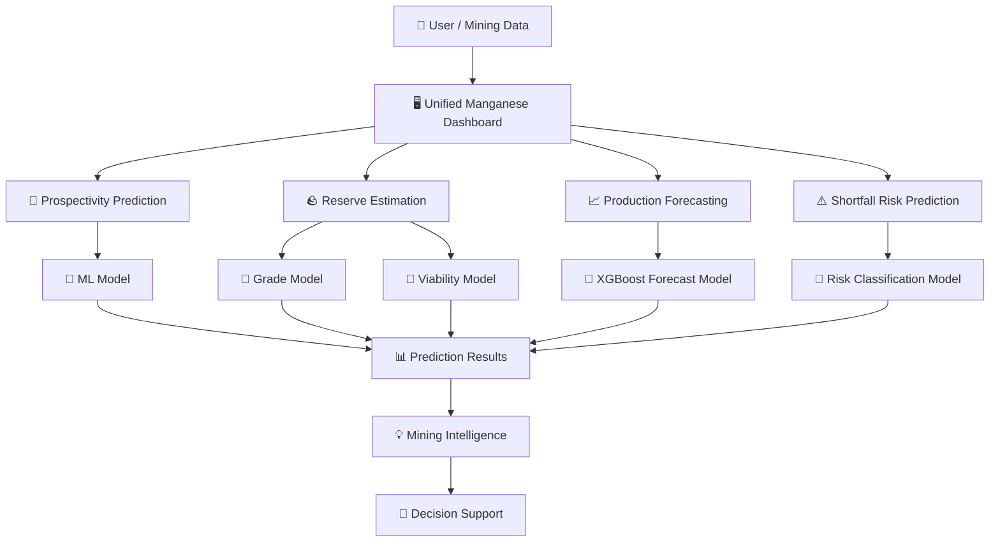
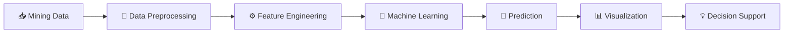
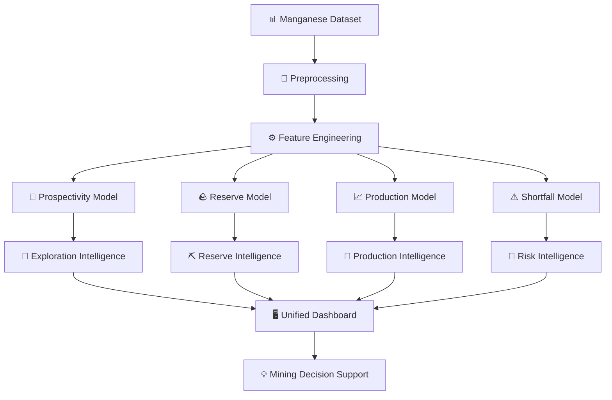
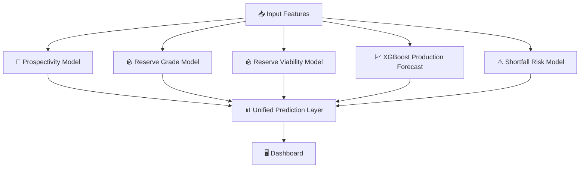
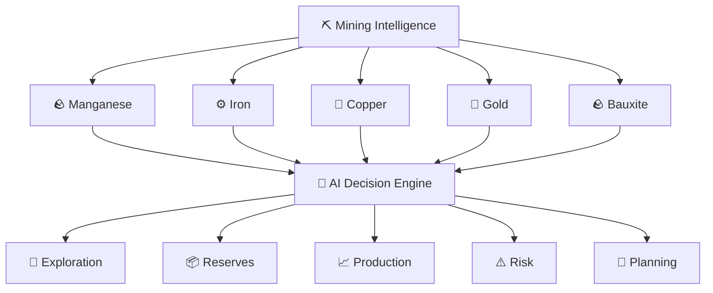

# ⛏️ Unified Manganese Intelligence Dashboard

### 🧠 AI-Powered Mining Intelligence Platform for Manganese Exploration, Reserves & Production

<p align="center">
  <strong>Turning Mining Data into Intelligent Decisions</strong>
</p>

<p align="center">

[](https://www.python.org/)
[](https://scikit-learn.org/)
[](#)
[](https://xgboost.readthedocs.io/)
[](https://streamlit.io/)
[](https://pandas.pydata.org/)
[](https://numpy.org/)

</p>

---

## 🚀 What is Unified Manganese Dashboard?

**Unified Manganese Dashboard** is an AI/ML-powered decision-support platform designed specifically for the **manganese mining ecosystem**.

Instead of building separate tools for exploration, reserve analysis, production forecasting and risk prediction, this project brings them together into **one unified intelligence platform**.

### 🎯 The platform integrates:

🔭 **Manganese Prospectivity Prediction**
🪨 **Manganese Reserve Estimation**
📈 **Manganese Production Forecasting**
⚠️ **Production Shortfall Risk Prediction**

The goal is to create a complete analytical pipeline:

> **Explore → Estimate → Forecast → Predict Risk → Make Better Decisions**

---

# 🧩 Core Intelligence Modules

| 🔢 | Module                        | Purpose                                                      |
| -- | ----------------------------- | ------------------------------------------------------------ |
| 🔭 | **Prospectivity Prediction**  | Predict areas with higher potential for manganese occurrence |
| 🪨 | **Reserve Estimation**        | Estimate manganese grade and reserve viability               |
| 📈 | **Production Forecasting**    | Forecast future manganese production                         |
| ⚠️ | **Shortfall Risk Prediction** | Identify potential production shortfall risks                |

---

# 🏗️ System Architecture



---

# 🔄 End-to-End Workflow



---

# 🧠 AI/ML Pipeline



---

# 🛠️ Technology Stack

## 🐍 Programming

<p align="center">


</p>

Python is used as the primary programming language for:

* Data processing
* Machine learning
* Model inference
* Dashboard development
* Application logic

---

## 🤖 Machine Learning

<p align="center">


</p>

Machine learning is used across the platform for:

* 🔭 Prospectivity prediction
* 🪨 Reserve estimation
* 📈 Production forecasting
* ⚠️ Shortfall risk prediction

---

## 🧠 Deep Learning

<p align="center">


</p>

The architecture is designed to support deep-learning models as the platform evolves, enabling future integration of:

* Neural Networks
* Deep Regression
* Deep Classification
* Geospatial Deep Learning
* Time-Series Deep Learning

> **Current production models are primarily classical ML/XGBoost-based; the Deep Learning layer represents the platform's extensibility rather than claiming every current model is deep learning.**

---

## 📊 Data Science

<p align="center">


</p>

Used for:

* Dataset processing
* Numerical computation
* Feature preparation
* Data transformation
* Model input preparation

---

## 🖥️ Dashboard

<p align="center">


</p>

The unified interface provides a centralized way to interact with the different manganese intelligence models.

---

# 🎯 Why a Unified Model?

Traditional workflows can require different tools for different mining decisions.

```text
🔭 Exploration
     ↓
🪨 Reserve Analysis
     ↓
📈 Production Planning
     ↓
⚠️ Risk Assessment
     ↓
💡 Decision Making
```

This project brings those stages together.

### Instead of:

```text
Tool A → Exploration

Tool B → Reserves

Tool C → Production

Tool D → Risk
```

### We build:

```text
              ┌─────────────────────┐
              │  MANGANESE AI HUB   │
              └──────────┬──────────┘
                         │
        ┌────────────────┼────────────────┐
        ↓                ↓                ↓
   🔭 Explore       🪨 Estimate      📈 Forecast
                         │
                         ↓
                  ⚠️ Predict Risk
                         │
                         ↓
                  💡 Take Action
```

---

# 📂 Project Structure

```text
Unified-Manganese-Dashboard/
│
├── 🖥️ unified_dashboard.py
│
├── 🔭 Manganese Prospectivity Prediction Model app.py
├── 🪨 Manganese Reserve Estimation app.py
├── 📈 Manganese Production Forecast app.py
├── ⚠️ Manganese Production Shortfall Risk Predictor (Proxy) app.py
│
├── 📓 SIH27009.ipynb
│
├── 🤖 best_manganese_prospectivity_model.joblib
├── ⚙️ manganese_prospectivity_preprocessor.joblib
│
├── 🪨 manganese_reserve_model_grade.pkl
├── 🪨 manganese_reserve_model_viability.pkl
├── ⚙️ manganese_reserve_preprocessor_viability.pkl
│
├── 📈 maganese production forecost xgb_manganese_model.joblib
│
├── ⚠️ manganese_shortfall_model.pkl
├── ⚙️ manganese_shortfall_preprocessor.pkl
│
├── 📋 X_train_columns.pkl
│
└── 📖 README.md
```

The repository currently contains the unified dashboard, four individual application files, the training notebook, and serialized model/preprocessing artifacts.

---

# ⚡ Key Features

### 🔭 Exploration Intelligence

Predict manganese prospectivity and support exploration-oriented analysis.

### 🪨 Reserve Intelligence

Estimate manganese grade and evaluate reserve viability.

### 📈 Production Intelligence

Forecast future production using machine-learning models.

### ⚠️ Risk Intelligence

Predict potential production shortfalls before they become major operational concerns.

### 🖥️ Unified Interface

Access multiple intelligence modules from one dashboard.

### 🧠 Modular ML Architecture

Each model can be independently trained, evaluated, updated and integrated into the unified platform.

---

# 🔬 Model Layer



---

# 💾 Trained Models

| 🧠 Model                      | 📦 Artifact                                               |
| ----------------------------- | --------------------------------------------------------- |
| 🔭 Prospectivity              | `best_manganese_prospectivity_model.joblib`               |
| ⚙️ Prospectivity Preprocessor | `manganese_prospectivity_preprocessor.joblib`             |
| 🪨 Reserve Grade              | `manganese_reserve_model_grade.pkl`                       |
| 🪨 Reserve Viability          | `manganese_reserve_model_viability.pkl`                   |
| ⚙️ Reserve Preprocessor       | `manganese_reserve_preprocessor_viability.pkl`            |
| 📈 Production Forecast        | `maganese production forecost xgb_manganese_model.joblib` |
| ⚠️ Shortfall Risk             | `manganese_shortfall_model.pkl`                           |
| ⚙️ Shortfall Preprocessor     | `manganese_shortfall_preprocessor.pkl`                    |

These model artifacts are present in the repository alongside the unified application.

---

# 🚀 Getting Started

## 1️⃣ Clone

```bash
git clone https://github.com/AravindInish/Unified-Manganese-Dashboard.git
cd Unified-Manganese-Dashboard
```

## 2️⃣ Install Dependencies

```bash
pip install streamlit pandas numpy scikit-learn xgboost joblib matplotlib plotly
```

## 3️⃣ Launch Dashboard

```bash
streamlit run unified_dashboard.py
```

---

# 📊 Project Vision

The current platform focuses on manganese, but the architecture can evolve into a broader **AI-powered Mining Intelligence Platform**.



---

# 🔮 Future Roadmap

* [ ] 🌍 GIS-based manganese prospectivity maps
* [ ] 🛰️ Satellite imagery integration
* [ ] 🧠 Deep-learning geological models
* [ ] 📡 Real-time mining data integration
* [ ] 📈 Advanced time-series forecasting
* [ ] 🔍 Explainable AI with SHAP
* [ ] 🗺️ Interactive geological maps
* [ ] 🤖 Automated model retraining
* [ ] ⛏️ Multi-mineral intelligence
* [ ] ☁️ Cloud deployment
* [ ] 📊 Mine-level benchmarking
* [ ] 🚨 Real-time risk alerts

---

# 🏆 Project Highlights

```text
                    ⛏️ UNIFIED MANGANESE
                         INTELLIGENCE
                              │
            ┌─────────────────┼─────────────────┐
            │                 │                 │
            ▼                 ▼                 ▼
        🔭 EXPLORE         🪨 ESTIMATE       📈 FORECAST
            │                 │                 │
            └─────────────────┼─────────────────┘
                              │
                              ▼
                         ⚠️ PREDICT
                            RISK
                              │
                              ▼
                        🧠 ANALYZE
                              │
                              ▼
                       🎯 DECIDE BETTER
```

---

# 👨‍💻 Author

## Aravind Inish

**AI/ML • Data Science • Software Development • Mining Intelligence**

🔗 GitHub: [@AravindInish](https://github.com/AravindInish)

---

# ⭐ Support

If you find this project useful:

⭐ **Star the repository**
🍴 **Fork the project**
🐛 **Report issues**
💡 **Suggest improvements**
🤝 **Contribute**

---

# ⚠️ Disclaimer

This platform is intended for **educational, research and decision-support purposes**.

Machine-learning predictions should not replace professional geological surveys, engineering studies, field validation, regulatory requirements or expert mining judgment.

---

## ⛏️ Built with AI. Designed for Mining. Driven by Data.

> **Explore smarter. Estimate better. Forecast earlier. Manage risk intelligently.**
